Next Generation State Management

good morning Monsieur!

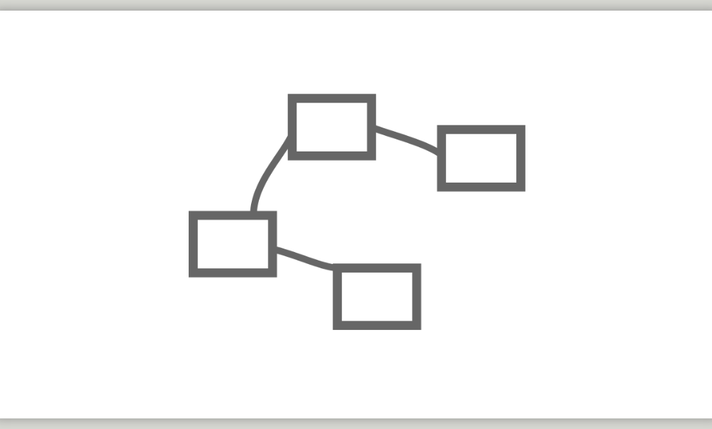

so today I want to talk about trees but not this kind of boring abstract dead trees no more I want to talk about living trees now I'm well aware you're all programmers so you might not be dead aware and more what trees are so I can tell you those things on the left over there for you those are fake those aren't real trees now 


if you want to remember again what living trees are you can for example 


what's Lord of the Rings again they have real trees there 


but also you can walk around in Paris there are pretty cool trees around 


anyway one warning about trees if you eat from the wrong one then you might die so we want but actually we will discover that that is a feature 

> `redux || mobx`

so Leah last year people talked about a lot about Redux or Moe Biggs and as order of MU Biggs I can only say one thing about it was strictly true yes good I did 

> MobX vs Redux: Comparing the Opposing Paradigm

there is a little more to say about it and that's what they're pretty did she gave to talk about rubrics versus Redux comparing the opposing paradigms so I think that kind of settles the matter and since we learned yesterday that yes fatigue is a good thing it's time to confuse you again 

> MobX vs Redux: Combining the Opposing Paradigm

so what if we tried to combine the opposing paradigms what we'll get is that 

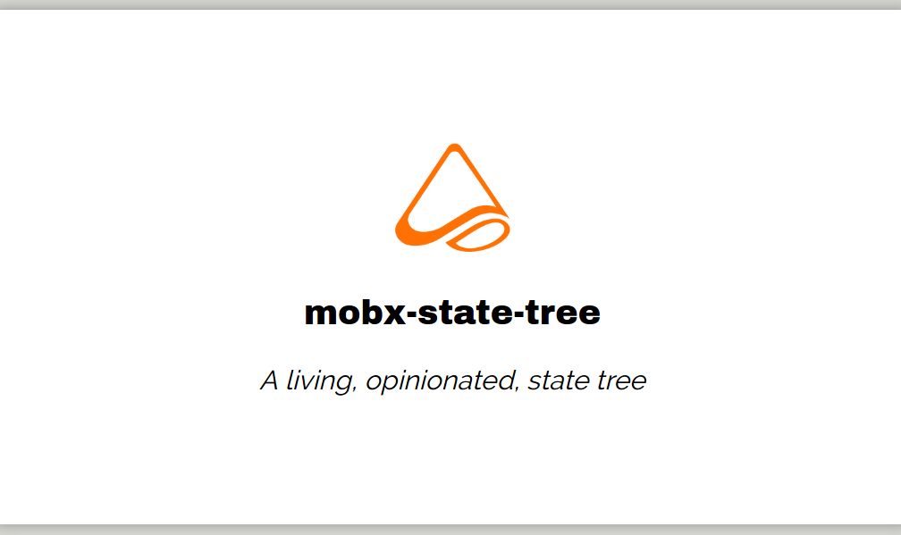

so I started experimenting together with the mobile community and out of that came the mobile stay tree unlike mobiles it's a very opinionated way of working with data so it has an architecture built into it it tells you how to do everything instead of just you have observables and things that react to it 

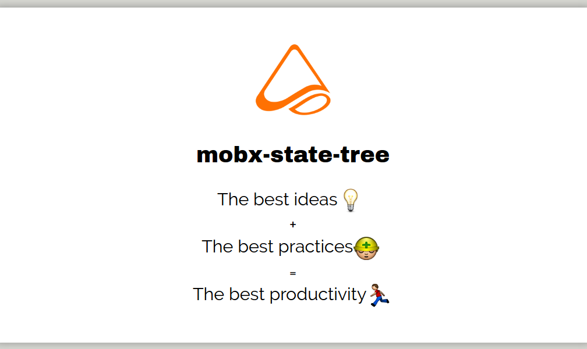

the idea is that it tries to combine the best of both paradigms it combines two tries to combine the best ideas and the best practices from the community put it in one package and then hopefully gets you to the best productivity that's what we're trying to get 

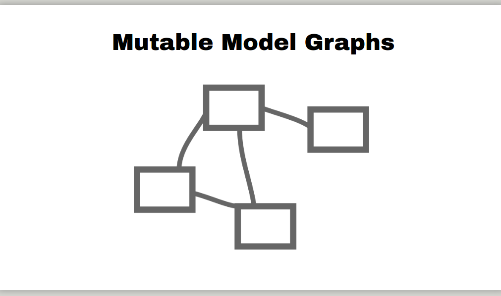

to so let's talk a bit about about what we know so far about state management so on one hand you have this idea that the more classic approach of mutable model graphs so all kinds of data can be related to our kinds of data and I call it models because it's often classes or objects or prototypes but something that allows you to co-locate your data with your actions and that is pretty convenient to work with its discoverable 

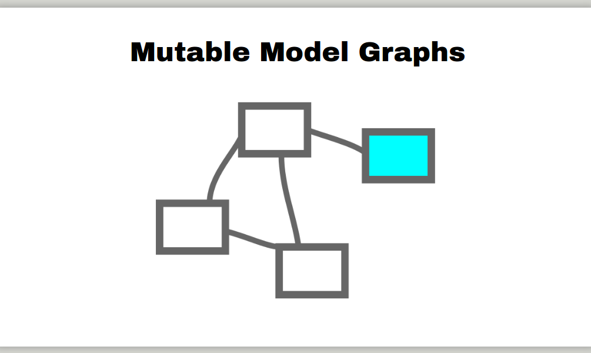


and it's super straightforward to modify things around

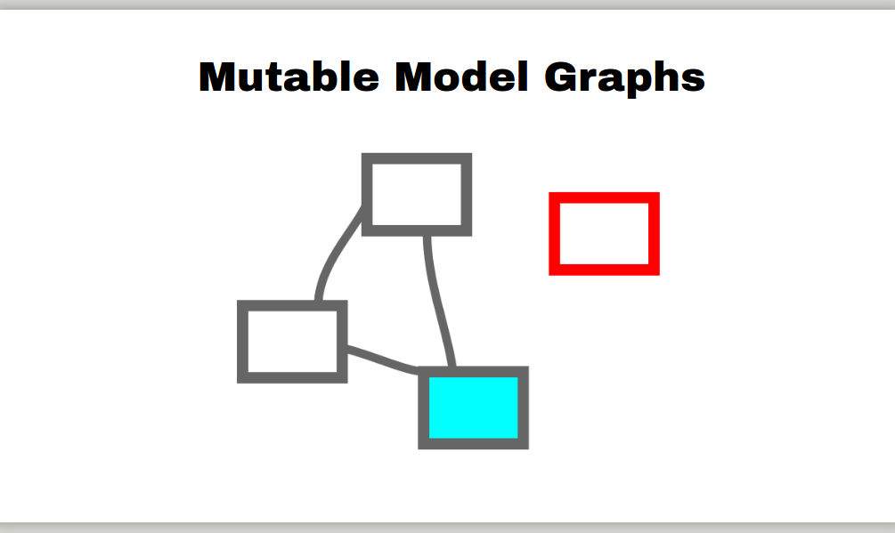

however the downside is you like all historical information on what is happening on 

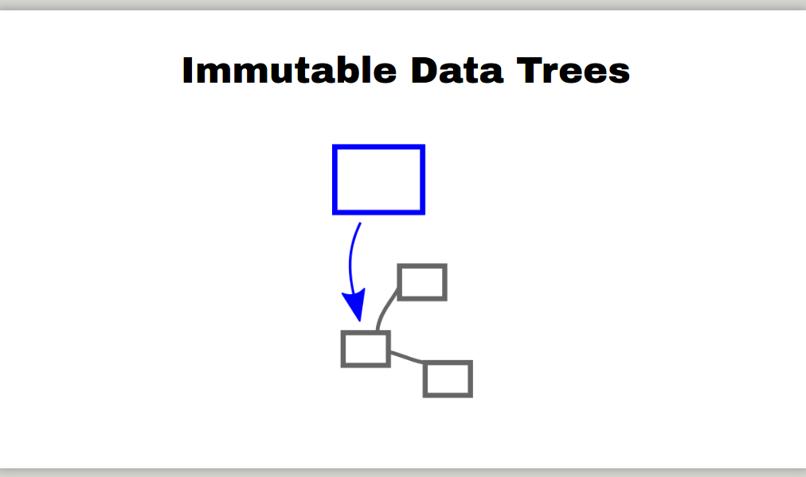

the other hand we have this idea of immutable data trees so our state is just a tree of data and doesn't modify any more but our store in the future 

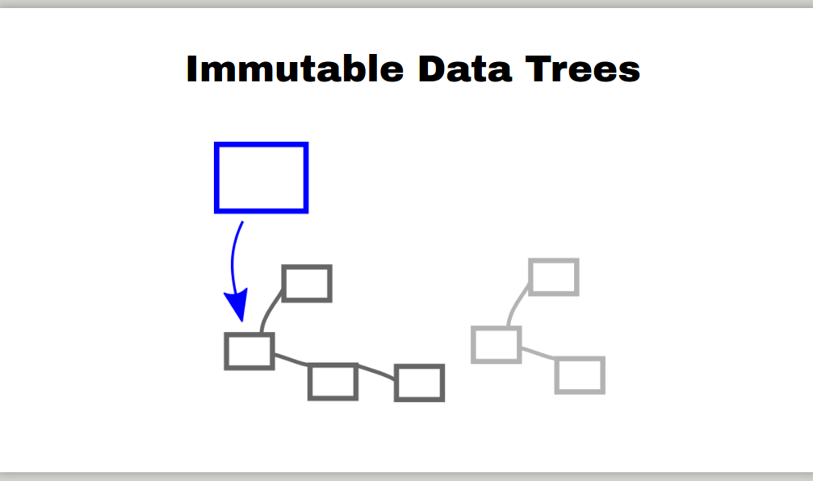

will just point to another tree and you're all familiar 

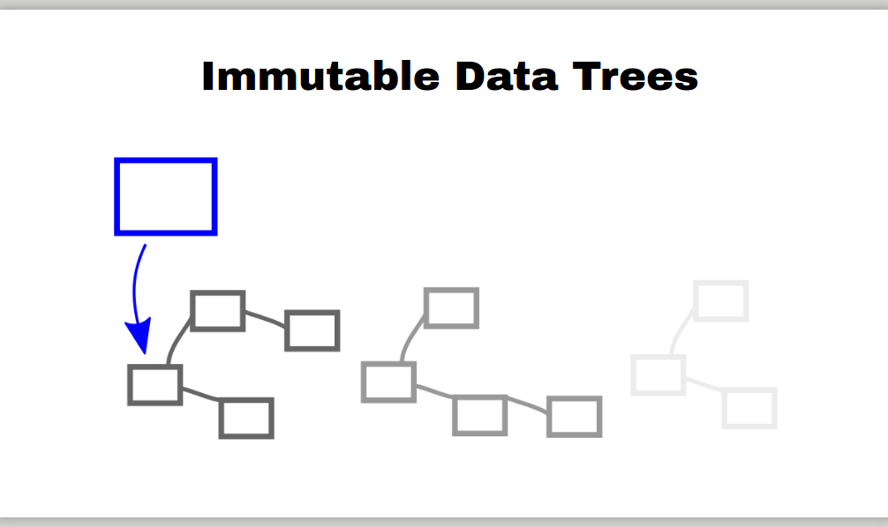

I think with this ID but this gets you things like time traveling and historical information 

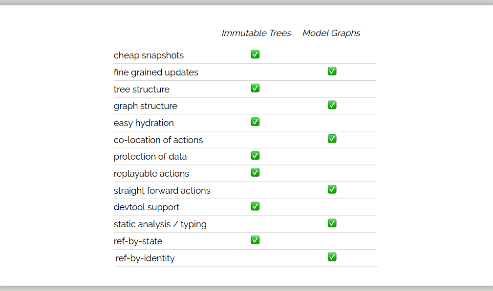

and both approaches have their own advantages so with Mullah graphs it's easy to discover your functionality it's straightforward to write actions but you don't have cheap snapshots and you don't have this structural sharing 

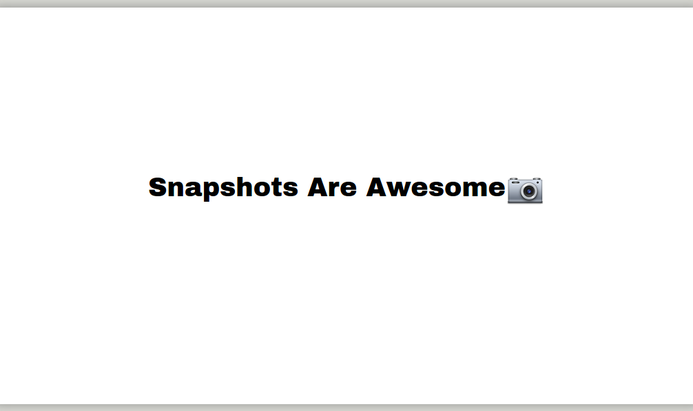

so we are going to dive in this list a bit deeper but first of all to talk about snapshots I think we all agree that having a snapshot of your data is awesome a snapshots are awesome like Texas are awesome I like the ID I like when they get me to get me roads they get me health care except if you're from the states but that's the detail but I don't like paying Texas 

> What if I could get them for free after each mutation?

so whether if we could just after each mutation get a snapshot for free so then we are no longer responsible ourselves of producing a new snapshot interactions with just one five some data and then a snapshot is produced from that 

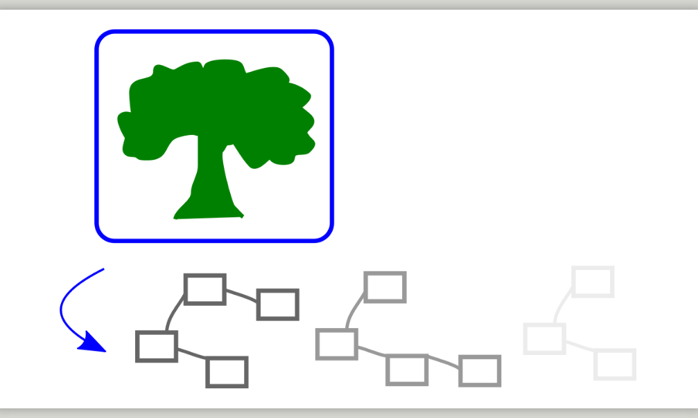

so that is basically the idea behind moving state tree we have a store and it is a living tree of data you can move stuff around you can change it but every time you do that a new snapshot gets produced 

[Demo](https://github.com/mobxjs/mobx-state-tree/tree/master/examples/bookshop)

so here's a very small book shop application it has some books and a cart and people who attended the workshop on Tuesday will recognize it and what we see is that we have here a record of all the states our application went through so it started quite empty and then the data uploads and the card got loaded and we have our snapshots 

```javascript
class Book {
    @observable title: string
    @observable price: number
    @computed get snapshot() {
        return {
            title: this.title,
            price: this.number
        }
    }
}
```

but the important thing about snapshots is that issues have structural sharing because otherwise it will be way too expensive if your application is running for a long time now in the mobile community there is already a best practice how to do that and that is simply if you have the concept of a book you give it a get snapshot function which produces an immutable view on that book and because it uses computer properties these things get memorized so the snapshot of a book will only update if either the title or its price changes and under no other circumstance 

```javascript
class Store {
    @observable books: Book[] = []
    @computed get snapshot() {
        return {
            todos: this.books.map(book => book.snapshot)
        }
    }
}
```

and if you then have a store which contains a list of books then the snapshot of that store is simply mapping over all the books and taking - snapshots 

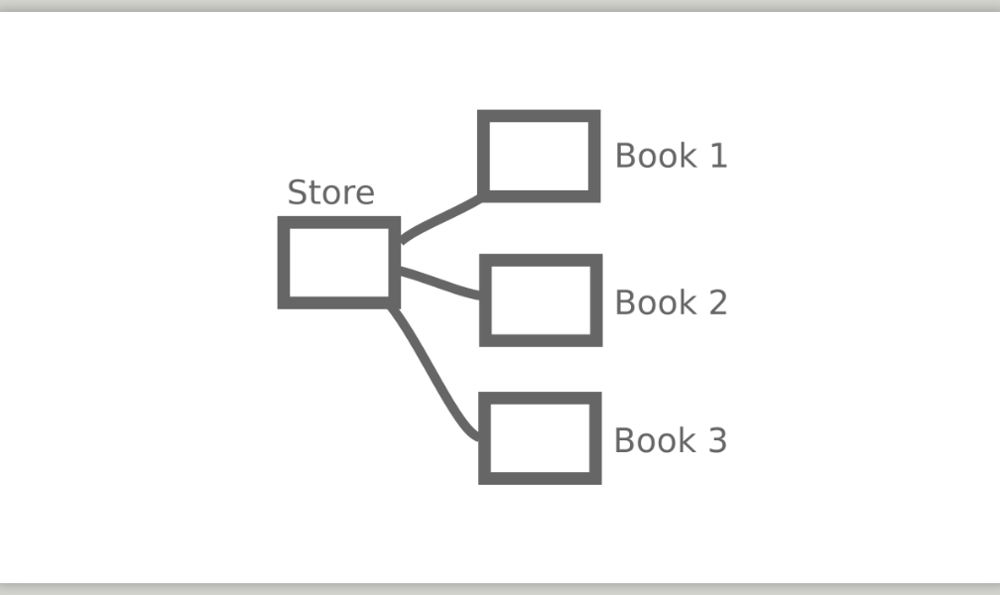

and it gets a structural sharing let me show you show you 

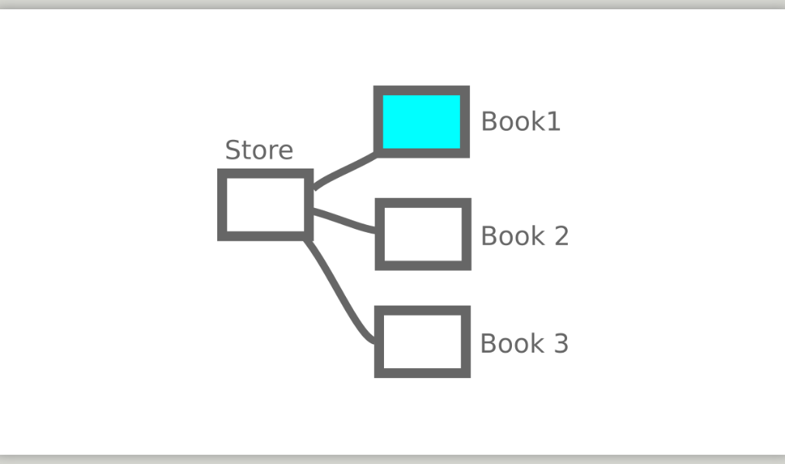

so suppose you modify something in this book then that will produce a new snapshot for that book 

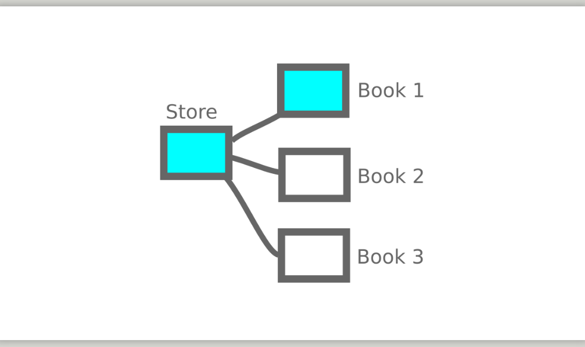

and that's snapshot - a propagated store closing the store to recompute its own snapshot and it will map overall to do but for all the - those are all the books that didn't change talked about to do so much I waited way too many talks about to do anyway so for all the other books the same snapshots will be used so you have structural sharing 

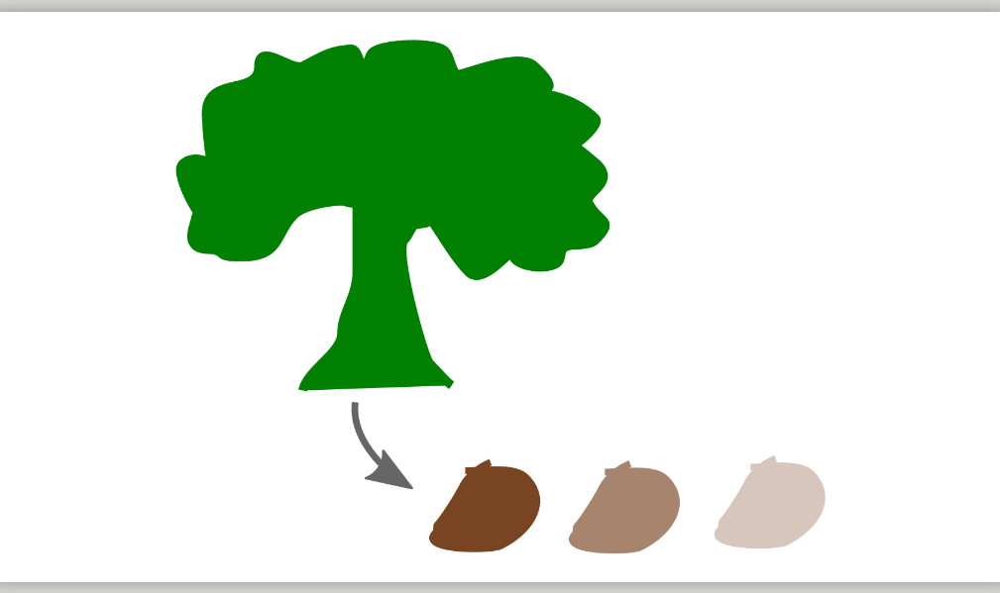

so basically we can this way build a tree and that's every time you change something captures its essence its DNA in a seed and then we have a new problem 

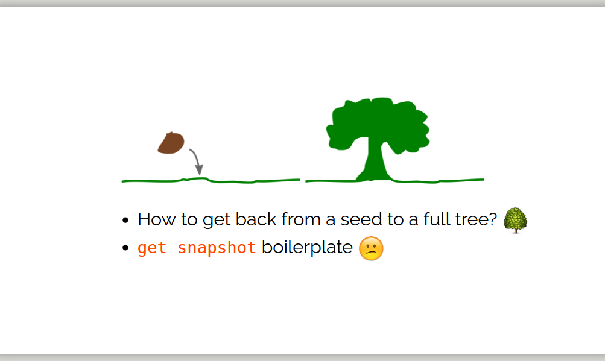

because we have to see but how do you get back to a full tree again where all the methods are getting co-located with the data and also how do you avoid all this snapshot boilerplate 

let me first demonstrate that we came back to our floor three so I can simply click on a snapshot and then my application is back in that state so this is our application storage when loading and this is where we are now so apparently we can restore from snapshots 

```javascript
import { onSnapshot, applySnapshot } from "mobx-state-tree"
const history = []
onSnapshot(store, snapshot => {
    history.push(snapshot)
})
replay(index) {
    applySnapshot(store, history[index])
}
```

and how this time-travelling works in this specific demo is just these few lines of code we can listen to old snapshots happening in the tree store them and we can replay them by just applying them back 

> Type Information!

and the crucial ingredients to be able to do this is type information and we have been talking about type systems and type information yesterday already and for most people type systems mean **compile time type checks** that's what they're good for but they are good for more they're also very useful for **real-time type checks** this is what we do for example they react prop types that's a kind of random type checking based on a type system provided in react. but you can also use type information to determine **what behavior** something should have so if we know about the type then we know how to create snapshots 

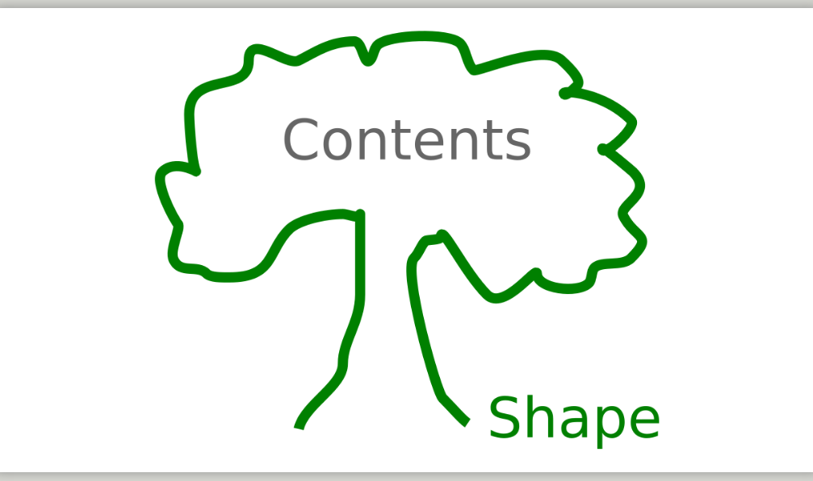

so mo picks a tree every tree consists of basically two things it's state or its contents and its shape or its type 

> Composing Types

```javascript
import {types, getSnapshot} from "mobx-state-tree"
const Type = types.model(properties, actions)
```

and abstractly speaking this is how we work with that so we can declare a type so we can model an object and we can declare what the property will be and what it actions will be 

```javascript
const instance = Type.create(snapshot)
instance.someAction()
```

and then we can use a snapshot to instantiate an instance of such some type and you can invoke some actions 

```javascript
const snapshot = getSnapshot(instance)
```

and I can get simply back to the snapshot again so we can easily interchange those 

```javascript
const Book = types.model({
    title: types.string,
    price: types.number
}, {
    setPrice(newPrice) {
        this.price = newPrice
    }
})
```

so the model of the book in this application it looks just like this it has two properties and it has an action to modify its price 

```javascript
const Store = types.model({
    books: types.array(Book)
})
```

and then the store is just combined composing the type of a book with the type of an array and then we have described our store and because we have this type information we know how to snapshot should be structured we know it's an array so we know that we should map over the children for a snapshot so we don't have to write it anymore 

```javascript
const store = Store.create({
    books: [{
        title:
            "The Hidden Life of Trees: What They Feel, How They Communicate",
        price: 24.95
    }]
})
```

so from now on I can just take some JSON data put it into the store type and then we have a real store 

```javascript
store.books[0].setPrice(13.57)
```

and I can start invoking actions on it 

> Composing Types

```javascript
store.books.push(Book.create({ title: "A Tree Grows in Brooklyn" }))
```

and even more because we have all this type information you can imagine that I try to add new books to this store but the fact I don't have to add new books 

```javascript
store.books.push({ title: "A Tree Grows in Brooklyn" })
```

I can just add new snapshots of books and the type system now this is supposed to be a book so to create a book 

```javascript
store.books[0].setPrice(13.57)
```

> Run Time Type Checking

```javascript
const store = Store.create({
    books: [{
        price: "24.95"
    }]
})
```

and of course with all this type of information we can do random type checking 

```javascript
Error while converting `{"books":[{"price":"24.95"}]}` to `Store`:
  at path "/books/0/title" value `undefined` is not assignable to type: `string`,
  at path "/books/0/price" value `24.95` is not assignable to type: `number`.
```

so if you make some mistake in your Jason you get this nice fine grained our majestic about what was wrong about the structure so if you in the end side it makes a tree is useless then at least you can use it as a JSON validator 

> Design Time Type Checking

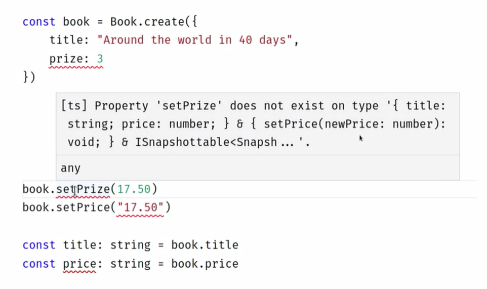

but what is really cool and what still blows my mind is that with this type system which is introduced by this library we can also do a design time type checking so this is a screenshot of a video cards and my type scripts a test project and it's in first what I do wrong how I use those moogles wrong now this might at first seem a pretty normal thing to do for type scripts but the cool thing is these types are not defined with type script these types are defined to public safety of the coccidia cell so type script is actually powerful enough nowadays to define a type system and type script and then do checks on it and it's it's pretty mind-blowing you have maybe to look at data fit into it to see how amazing it is probably flock and do it is as well I'm just not enough into flow but if somebody wants to make a pull request to add flow toppings it will be perfect 

> Type Checking

> TComb inspired: collections, refinements, unions, literals, recursive types

and this type checking is based on the work of Gil Conte and he wrote a library type combinators and much Amundson see he put it into the mobile city library so those guys are actually responsible for a large part of the library as pretty powerful test collections refinement unions literals if your recursive types can even have types across different files with circular dependencies 

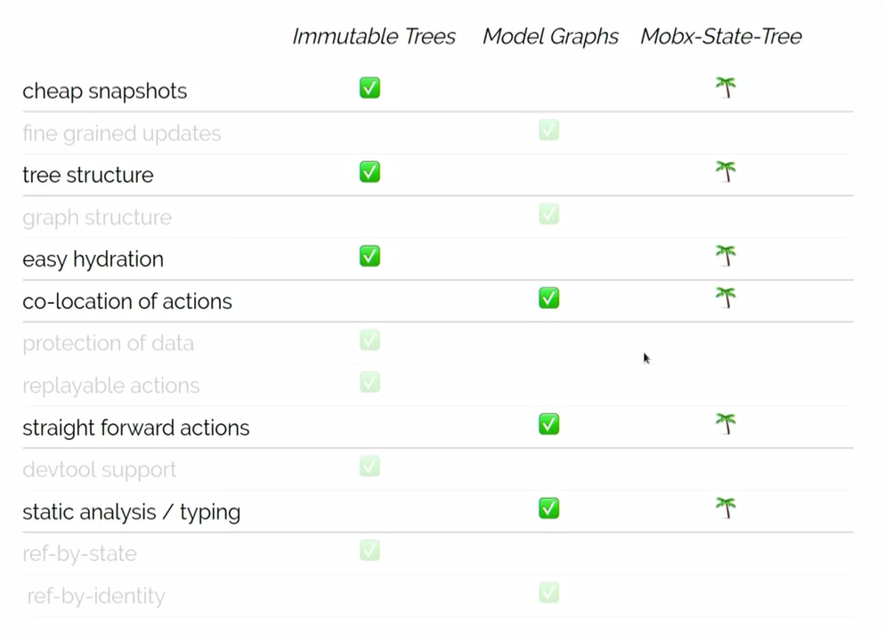

so what you've seen so far is that we could combine quite a set of features from both worlds so we have sheep searchingly shared snapshots we have a tree structure we can easily hydrate and dehydrate we can go look at our actions and our actions themselves they are pretty set forward to right we just want to fly some local data and we have the static and runtime type checking 

> Patches Demo

but there's more because we fixed a tree is based on the leaks it has this notion of fine grained observability where every property in your system is observable so that means that Republic's a tree you can simply subscribe to the bets stream of your data so here are all the batches happening in my application so snapshots I cannot exchange with my server they're way too big for that but I can exchange snapshots with the backends to distribute changes so I can just change something and knew Jason bets gets produced and I can reapply the spatulas so I can also work with Jason patches out of the box 

> Actions

- Instances can only be modified through actions
- Actions can only modify own subtree

```javascript
const Book = types.model({
    title: types.string,
    price: types.number
}, {
    setPrice(newPrice) {
        this.price = newPrice
    }
})
```

let's talk a bit more about actions actions I said they're pretty straightforward but you have some special properties first of all you cannot modify a state tree without using an action 

```javascript
store.books[0].title = "I hate trees!"
```

```javascript
Error: Cannot modify 'Book@/books/0',
the object is protected and can only be modified by using an action.
```

it will just throw an exception so if you try to modify something directly by default you get this exception you're down there you're trying to modify your state without using an action and this is important because if you are forced to use actions to multi state then we can benefit from replayability 

> Demo

so I can for example go to the books and add some book to my part and if I look here then I see that action also I actually can also be recorded and I can go to the card and you can see that I can just replay this action on my state so I can replay and record snapshots I can replace patches I can replay actions 

- Replayable
- Method invocation *produced* action description
- Middleware support

however we don't produce any action in description anywhere we don't dispatch reactions now mo backs a tree it's in first you just invoke a method and we produce action description for you and you can even intercept that if you want 

> Use Case: Modify Complex Data In Wizard

but that makes it super straightforward to use actions and still be able to replay those figs and a nice use case for replaying actions one is having different clients working on same data and synchronizing on actions but the other one is where you have this complex tree of data and user starts to edit this data in a wizard and usually that gets complicated if there's a lot of pools of data potential to be edited 

```javascript
import { clone, recordActions } from "mobx-state-tree"
const bookCopy = clone(store.books[0])
```

but that's simple now as well because what you can do is you can just take some part of the tree and clone it and the cosmic state tree is a fully recursive concept so every node in our tree is a state tree in itself and every operation we can invoke on the root we can invoke on any nodes we can just start listening on actions in a specific sub tree 

```javascript
function clone(tree) {
    return getType(tree).create(getSnapshot(tree))
}
```

so we then clone a book which is simply taking the type and taking it snapshots to produce a new instance 

```javascript
import { clone, recordActions } from "mobx-state-tree"
const bookCopy = clone(store)
const recorder = recordActions(bookCopy)
```

so we can clone a book and we can start an action recorder which just stores all the actions being involved 

```
...user modifies the book in a wizard
And upon commit...
```

and then he also starts modifying the z10 wizard 

```javascript
recorder.replay(store.books[0])
```

and in the end if he is ok with it we can just replay those actions onto the original object and we have this atomic commit of all the changes he made 

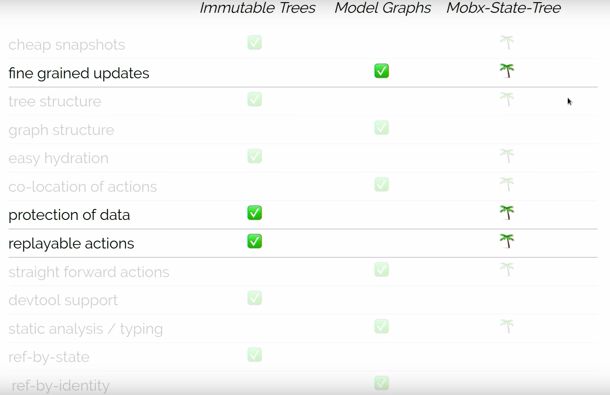

so with that we have fine grained updates we have protection of data and we have replayable transactional data 


around the des Vosges guy in Lord of the Rings movies he wants set def is a gift to men I'm not sure whether I entirely agree on that statement but there are some use to it as you will see 

> References

```javascript
function printPrice(book: Book) {
    setTimeout(
        () => console.log(book.price),
        1000
    )
}
printPrice(store.books.get("ISBN-123"))
```

so let's think a very bit about references in JavaScript so here's a small function that prints the price of a book the only nasty thing is it prints it one second for now now what assumptions can we make on the price that gets printed well turns out that largely depends on which model you use what does a reference really presents what does the book reference as argument what does it represent 


it's like asking the questions is this four times the same tree or are these four different trees it's kind of conceptual 

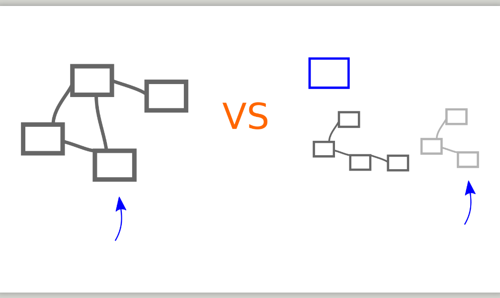

and depends on semantics so if you use musical data than a reference refers to a concept and the concept might change over time but you refer to the same concept the Orient of immutable data you always have a reference to a state of a concept somewhere in history or in current but to the very specific state 

```javascript
function printPrice(book: Book) {
    setTimeout(
        () => console.log(book.price),
        1000
    )
}

printPrice(store.books.get("ISBN-123"))
```

**Immutable Trees**
- price won't have changes
- price might be stale

**Mutable Model Graphs**
- price might have changed
- price will not be stale

so if this book is immutable then we know for sure that one second from now that price won't have changed the price of the book we passed to that function with mutable data well the price might have changed the price your prints might be different from the one it was when we passed in that book to the function but if the immutable data the price might be still that book with ISBN one two three might have received an update but that's in a different state tree and with mutable models we know for sure that it might have changed but at least you will be printing the latest price and what semantics you need depends on what feature you are building and if I were a consumer of this book shop I know what semantics I would need that is printer one which is the cheapest 

```javascript
function printPrice(book: Book) {
    setTimeout(
        () => console.log(book.price),
        1000
    )
}
```

```javascript
printPrice(store.books.get("ISBN-123"))
```

```javascript
printPrice(getSnapshot(store.books.get("ISBN-123")))
```

but if mopix a tree you can choose between semantics so you can give either a reference to this book in the state tree which in which case you'll refer to the concept or you can pass a reference to its snapshot and which schedule refer to its state 

```javascript
printPrice(store.books.get("ISBN-123"))
store.removeBook("ISBN-123")
// what will be printed?
```

```
Error: This object has died and is no longer part of a state tree. It cannot be used anymore.
```

but you can can get it make it even a seer so suppose we involve this print function and right after that we remove this book from our store what will be printed for the immutable case it doesn't matter for the mutable case at your prints whatever happens to be the last price known in system but if you using mobile satori something else will happen you will get an exception you will get an exception telling you how you're using some data you're reading from some data which is not even in your state anymore so probably the data you are using is coming from some still reference so maybe you shouldn't be using this 


you might be thinking isn't that the kind of rule but well it's like if you try to hang up a swing and a tree then you better make sure that that's swing is attached to a living branch go to a dead one because otherwise this picture ends very badly 

> mobx-state-tree

- Protection against uncoordinated modifications 
- Protection against stale reads

so one more back satyr you provide you is not only protection against unintended modification it even gets you protection against accidentally still reads from data you were not supposed to be used to be used anymore 


so that is why I said sometimes it's a feature when you flick from the wrong tree and you die based on that 

> Graphs

```
bookStore
   - books
       - book A
       - book B
   - cart
       - entry 1
           - book A ?
           - quantity
       - entry 2
           - book B ?
           - quantity
```          

finally so far we have just been talking about trees because trees are easy to traverse etc however not all models of applications fit nicely to trees even our bookshop doesn't fit nicely into our tree because our card entries refer to books however we cannot make a real reference here because then we would introduce a graph we would lose our tree semantics so we have to normalize our data 

```javascript
const CartEntry = types.model({
    amount: types.number,
    book: types.reference(Book)
})

cartEntry.book = bookStore.books[0]

console.log(bookEntry.book.title) // OK

console.dir(getSnapshot(bookEntry))
```

do we and we mobic say tree we have the type information of the shape of the tree you defined so we can just tell the system hey this book in the court entry that's not a book itself it's just a reference to a book and after that you can just interact with record entry you can assign real books to it you can read from that cart entry and you get a real book back you can access its data but behind the scenes the normalization is done for you so even though the book entitled book contains a real book 

```javascript
{
    amount: 3,
    book: "24"
}
```

if you print it snapshots you will see that it's in the background still normalized it does the reference management for you 

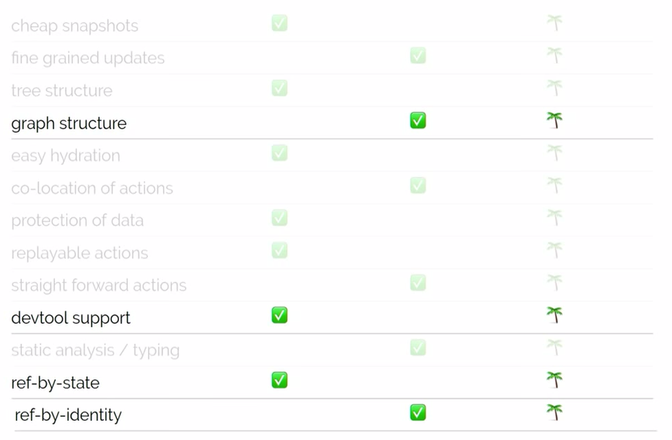

so of that we have a tree with which you can interact as if it's a graph we can have dev tools as I showed you in the demo and we can choose which semantics we need for our references either we can refer to a concept to an identity or we can refer to a concept in a specific state whatever we need but there's something more 

> [Demo](https://github.com/mobxjs/mobx-state-tree/tree/master/examples/redux-todomvc)

so this is the radix to do MVC application I'm pretty sure you all once run this thing and these are the dev tools we're so familiar with so we can play back and forward in time you've all seen this except there's something weird with this Redux to do MVC application I remove the reducer file and after that okay it's a new file and in that I put a more big state tree model of a to-do list but the rest of the application is the same and it still works it's it has redux connect components it has actual dispatching it just doesn't have any reducers anymore it has a stay tree but because a state tree can provide everything we need snapshots applying snapshots action descriptions replaying actions we can interchange those two paradigms that one 

```javascript
import { types } from 'mobx-state-tree'
const Todo = types.model({
    text: 'Learn Redux',
    completed: false,
    id: 0
})
const TodoStore = types.model({
    todos: types.array(Todo),
    findTodoById: function (id) {
      return this.todos.find(todo => todo.id === id)
    }
}, {
    DELETE_TODO({ id }) {
      this.todos.remove(this.findTodoById(id))
    }
    // .. and more
})
```

so this is what our to do store now basically look like pretty straightforward we define the shape and we define some actions on top of it and you see the direction still has a weird uppercase name but that's because that's the name of the action that gets dispatched so the names have to match but they're basically proof proves that we can have a meatball tree and all the features we know from the immutable world 


so we can combine the two opposing paradigms so that's what superb exits a tree tries to do and you can already use it the there are actually some people using it in prediction already it's not 100 yes because that talks are not completely to date but hey versus better 


so [start use](https://github.com/mobxjs/mobx-state-tree) it play with it and last word of advice hug some tree today thanks